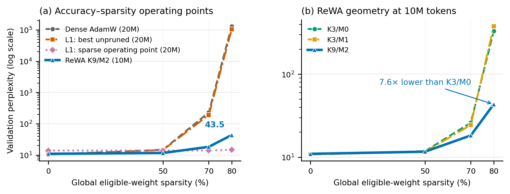

# ReWA on a small LLaMA-style language model

This project tests whether ReWA produces a better perplexity--global-sparsity
trade-off than AdamW and L1 regularization in a decoder-only Transformer.

## Stage-one scope

- TinyStories language modeling
- 6-layer LLaMA-style decoder (RMSNorm, RoPE, SwiGLU)
- Dense AdamW, AdamW + L1, and ReWA-AdamW
- ReWA on attention and MLP matrices only
- Global pruning at fixed target sparsities

Embeddings, the tied language-model head, and RMSNorm parameters are excluded
from ReWA and pruning. Both eligible and whole-model sparsity are reported.

## Environment

The Seeta3 image already provides PyTorch. Create a lightweight environment
that reuses it:

```bash
cd /root/autodl-tmp/rewa-llm
/root/miniconda3/bin/python -m venv --system-site-packages .venv
.venv/bin/pip install -r requirements.txt
```

## Prepare TinyStories

The experiment pins TinyStories to commit
`f54c09fd23315a6f9c86f9dc80f725de7d8f9c64`. On AutoDL, Hugging Face can
use the public mirror endpoint:

```bash
export HF_ENDPOINT=https://hf-mirror.com
```

Alternatively, AutoDL's built-in academic proxy can be enabled for the
download shell with `source /etc/network_turbo`; disable it afterwards with
`unset http_proxy https_proxy` because the proxy can affect unrelated network
traffic.

Smoke-test subset:

```bash
.venv/bin/python scripts/prepare_tinystories.py \
  --output-dir data/tinystories-smoke \
  --vocab-size 8192 \
  --revision f54c09fd23315a6f9c86f9dc80f725de7d8f9c64 \
  --streaming \
  --max-train-docs 5000 \
  --max-validation-docs 500
```

Frozen stage-one pilot subset (approximately 20M training tokens after
tokenization):

```bash
.venv/bin/python scripts/prepare_tinystories.py \
  --output-dir data/tinystories \
  --vocab-size 8192 \
  --revision f54c09fd23315a6f9c86f9dc80f725de7d8f9c64 \
  --streaming \
  --max-train-docs 100000 \
  --max-validation-docs 5000
```

## Tests and smoke run

```bash
.venv/bin/python -m unittest discover -s tests -v
.venv/bin/python train.py \
  --data-dir data/tinystories-smoke \
  --out-dir outputs/smoke-rewa \
  --method rewa --max-iters 20 --eval-interval 10 --eval-iters 5 \
  --batch-size 4 --gradient-accumulation-steps 2
```

## Stage-one methods

```bash
bash scripts/run_stage1.sh dense 0
bash scripts/run_stage1.sh l1 0 --l1-alpha 1e-6
bash scripts/run_stage1.sh rewa 0 --rewa-k 9 --rewa-m 2 --rewa-eps 0 \
  --rewa-weight-decay 1e-4
```

## Automated single-seed pilot

The pilot runner executes both dense learning rates, selects the one with the
lowest training-time `best_val_loss`, and then runs the full L1 and ReWA grids
with that learning rate. Each checkpoint is evaluated at 0%, 30%, 50%, 70%,
80%, 90%, and 95% eligible global sparsity.

The default ReWA grid uses the canonical AdamW recipe
`--rewa-configs 9:2 --rewa-eps 0` with y-space weight decay in
`1e-4`, `1e-1`, and `1`. It satisfies the documented
`0 <= M < K - 1` regime. ReWA epsilon changes the algorithm's attenuation and
is not treated as a generic numerical-stability epsilon. The wider decay grid
accounts for the pilot's short 611-step schedule; `1e-4` remains the original
recipe anchor.

```bash
.venv/bin/python scripts/run_pilot.py \
  --data-dir data/tinystories \
  --train-tokens 20000000 \
  --batch-size 8 \
  --gradient-accumulation-steps 16 \
  --eval-interval 100 \
  --eval-iters 50 \
  --pruning-eval-iters 100
```

The command is restart-safe: completed runs are skipped, a completed training
run with a missing pruning report is evaluated, and a partial run resumes from
`latest.pt`. Existing run directories with incompatible settings are preserved
and reported as errors; use a new `--output-root` for a different budget.

Progress and provenance are recorded in
`artifacts/stage1/run-manifest.csv`. At the end, the runner calls
`scripts/summarize_stage1.py` to produce:

- `artifacts/stage1/global-pruning.csv`
- `artifacts/stage1/layer-sparsity.csv`
- `artifacts/stage1/training-curves.csv`
- `artifacts/stage1/ppl-vs-sparsity.png`
- `artifacts/stage1/candidate-grid-oracle-envelope.csv`
- `artifacts/stage1/candidate-grid-oracle-envelope.png`
- `artifacts/stage1/RESULTS.md`

`RESULTS.md` labels the evidence as a single-seed pilot and selects one
configuration per method using the common unpruned validation evaluation. The
original plot follows each selected run across all sparsities. A separate
candidate-grid oracle/Pareto envelope selects the lowest observed PPL within
each method at every sparsity and records the chosen run and configuration.
Because that per-point selection and reporting use the same validation set, the
envelope is an optimistic pilot diagnostic rather than a held-out estimate or
a single-run curve.
Summary generation can also be rerun independently:

```bash
.venv/bin/python scripts/summarize_stage1.py \
  --manifest artifacts/stage1/run-manifest.csv
```

## Staged ReWA hyperparameter search

`scripts/run_rewa_tuning.py` extends the frozen stage-one Dense/L1 comparison
without changing their checkpoints or measurements. It first screens valid
`(K, M)` pairs and learning rates at 3M tokens with an early 70%/80% pruning
check, retains the canonical `(K, M) = (9, 2)` geometry alongside the best
accuracy and high-sparsity short runs, retrains four runs
from scratch at 10M tokens, searches ReWA epsilon and y-space weight decay, and
finally retrains two finalists from scratch at 20M tokens.

```bash
.venv/bin/python scripts/run_rewa_tuning.py \
  --data-dir data/tinystories \
  --output-root outputs/stage1-rewa-high-lr \
  --artifact-dir artifacts/stage1-rewa-high-lr \
  --baseline-artifact-dir artifacts/stage1 \
  --device cuda --dtype float16
```

For the local 4GB Windows GPU, the first pass preserves the same effective
tokens per optimizer step while reducing each microbatch to one sequence:

```powershell
.\.venv\Scripts\python.exe scripts\run_rewa_tuning.py `
  --data-dir data\tinystories `
  --screen-configs 3:0 3:1 9:2 `
  --learning-rates 0.006 0.012 0.024 0.036 `
  --batch-size 1 --gradient-accumulation-steps 128 `
  --pruning-batch-size 1 --top-k 4 --stop-after screen `
  --device cuda --dtype float16
```

This local pass evaluates twelve 3M-token runs. The restart-safe manifest lets
the screen continue after interruption, and only the selected configurations
advance to the more expensive 10M-token stage.

The first search put every surviving geometry at its `3e-3` learning-rate
boundary. The canonical CIFAR-10 ReWA+AdamW launch inherits `lr=0.256` from its
YAML config. A local numerical bracket then found that `0.024` and `0.036`
complete the 32-step smoke while `0.048` becomes non-finite for both K=3/M=0
and K=9/M=2. The 3M-token screen therefore refines the stable side with
`0.006`, `0.012`, `0.024`, and `0.036`. This follows the paper's stagnation
analysis: a base step size that is too small in the extended `y` coordinate can
leave parameters unable to cross the zero neighborhood.
The high-LR runner uses a zero cosine floor, matching the source protocol's
large-early/small-late schedule.
The geometry screen keeps canonical raw `wd=1e-4`. Later decay variants are
defined at reference `lr=3e-3` and scaled inversely with LR so the scheduler's
first-order cumulative decay remains comparable across the large-LR bracket.

```bash
.venv/bin/python scripts/run_rewa_tuning.py \
  --data-dir data/tinystories \
  --output-root outputs/stage1-rewa-high-lr \
  --artifact-dir artifacts/stage1-rewa-high-lr \
  --baseline-artifact-dir artifacts/stage1 \
  --learning-rates 0.006 0.012 0.024 0.036 \
  --device cuda --dtype float16
```

The runner is restart-safe. It records completed, running, and failed attempts
in `artifacts/stage1-rewa-high-lr/tuning-manifest.csv`, preserves selection
reasons, skips compatible completed work, and does not rerun matching failed
configurations unless `--retry-failed` is supplied. Its final deliverables are
`screen-ranking.csv`, `ten-million-ranking.csv`,
`final-global-pruning.csv`, `rewa-tuning-vs-baselines.png`, and `RESULTS.md` in
the same artifact directory. The sparse finalist is selected by mean 70%/80%
validation loss under an unpruned-PPL guard, and the report declares a positive
signal only when one run beats Dense and L1 at both 70% and 80%. All
positive-epsilon candidates are restricted to
the documented Configuration-B range `M < 2`; every candidate also satisfies
the base condition `0 <= M < K - 1`.

Stopping after the 10M confirmation stage also produces
`ten-million-global-pruning.csv` and `CONFIRM_RESULTS.md`, including the
frozen Dense/L1 comparison and the distinction between a best-unpruned curve
and an optimistic configuration-grid sparsity envelope.

### Confirmed high-learning-rate result



**Peak LR `0.006` allows the canonical K9/M2 geometry to retain low
perplexity through 80% global pruning.** At 10M training tokens, K9/M2 reaches
PPL 10.98 before pruning, 18.29 at 70%, and 43.47 at 80%. K3/M0 and K3/M1
reach comparable unpruned PPL but rise to 330.69 and 379.54 at 80%,
respectively. The frozen Dense and best-unpruned L1 baselines use 20M training
tokens and rise to PPL 131020.73 and 103805.62 at 80%.

Regenerate the GitHub PNG and paper-ready vector PDF directly from the
committed result tables:

```bash
.venv/bin/python scripts/plot_high_lr_results.py
```

The exact table, selection rule, and the separate strongly regularized L1
operating point are documented in
[`artifacts/stage1-rewa-high-lr/CONFIRM_RESULTS.md`](artifacts/stage1-rewa-high-lr/CONFIRM_RESULTS.md).

## Global pruning evaluation

```bash
.venv/bin/python evaluate_global_pruning.py \
  --checkpoint outputs/stage1-pilot/rewa-k9-m2-wd1e-4-lr6e-4-seed0/best.pt \
  --data-dir data/tinystories \
  --sparsities 0.3 0.5 0.7 0.8 0.9 0.95
```

The evaluator ranks all eligible attention and MLP weights together by
absolute value, sets the globally smallest fraction to zero, and reevaluates
validation perplexity.
